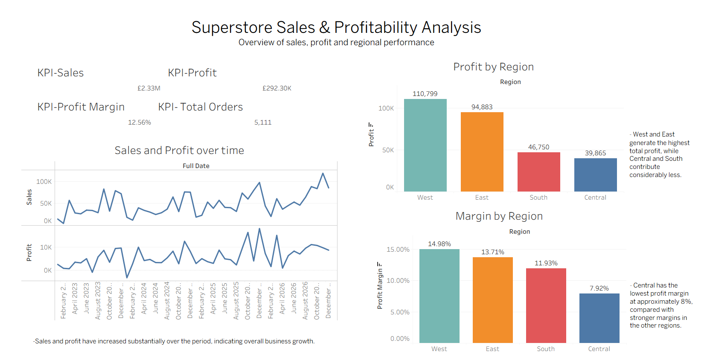
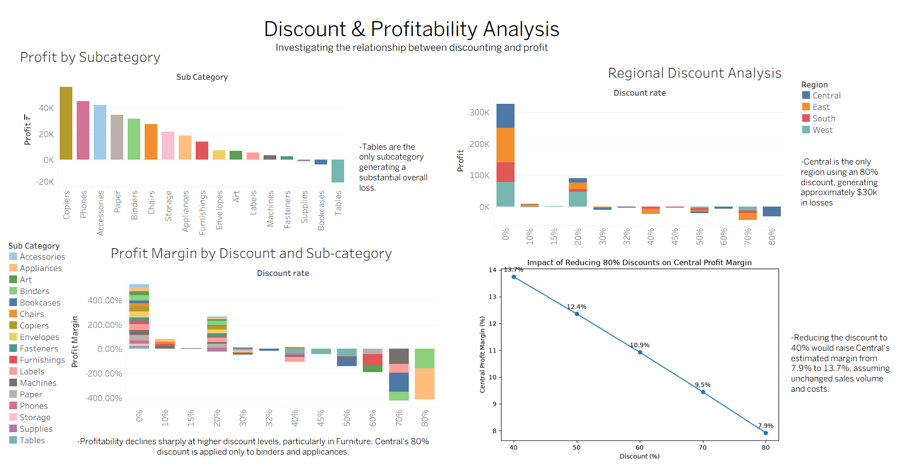

# Superstore Sales & Profitability Analysis

An end-to-end data analytics project analysing sales, profitability, discounting and regional performance using the Superstore dataset.

The project combines SQL Server, Tableau and Python to investigate business performance, identify profitability issues and model potential improvements through a discounting what-if analysis.

## Dashboards

### Executive Overview



### Discount & Profitability Analysis



## Project Overview

This project analyses the Superstore dataset to understand overall business performance and identify the main drivers of profitability.

The analysis focuses on four key questions:

- How have sales and profit changed over time?
- Which products and regions contribute most to profitability?
- How does discounting affect profit and profit margin?
- Which areas of the business may require changes to improve profitability?

The project uses SQL Server for data preparation and analysis, Tableau for interactive visualisation and dashboard development, and Python for a discounting what-if analysis.

## Tools & Technologies

- **SQL Server / SSMS** — Data preparation, star schema development and business analysis
- **Tableau** — Interactive dashboards and data visualisation
- **Python** — Scenario analysis using pandas and matplotlib
- **GitHub** — Project documentation and portfolio repository

## Data & Methodology

The project uses the Superstore dataset containing approximately 10,000 sales transactions across multiple regions, product categories and customer segments.

The raw data was loaded into SQL Server and transformed into a relational star schema consisting of:

- **FactSales** — sales transactions, quantities, discounts and profit
- **DimCustomer** — customer information
- **DimProducts** — product and subcategory information
- **DimLocation** — regional and geographic information
- **DimDate** — date information for order and shipping dates

SQL was then used to analyse sales, profit, profit margin, discount levels and regional performance.

The resulting data model was connected to Tableau to create interactive dashboards covering overall performance, regional profitability and the relationship between discounting and profit.

Python was used separately to perform a what-if analysis on Central region transactions receiving an 80% discount. The analysis modelled the potential effect of reducing those discounts while assuming sales volume and underlying costs remained unchanged.

## Key Findings

### 1. Overall business performance improved

Sales and profit increased substantially over the period analysed, indicating overall business growth. Profit margin also improved over the period analysed.

### 2. Higher discounting is associated with weaker profitability

Profitability declines significantly as discount levels increase, with Furniture showing the clearest deterioration. At higher discount levels, several Furniture subcategories become loss-making, indicating that aggressive discounting can have a substantial impact on profitability.

### 3. Tables are a significant loss-maker

Tables are the most significant overall loss-making subcategory in the analysis. Their losses are spread across multiple discount levels, making the issue more significant than any single discount band alone.

### 4. Central has a specific extreme-discount problem

Central has the lowest overall profit margin of the four regions at approximately 7.9%.

It is also the only region with transactions recorded at an 80% discount. These transactions, involving Binders and Appliances, generated approximately $16,980 in sales but resulted in a loss of approximately $30,565.

This extreme discounting is a significant contributor to Central's weaker overall profitability.

## What-If Analysis

A Python scenario analysis was used to estimate the potential impact of reducing Central's 80% discounts.

The analysis recalculated sales and profit at discount levels from 80% down to 40%, while assuming that:

- The same transactions would have taken place
- Sales volume would remain unchanged
- Underlying costs would remain unchanged

Under these assumptions, reducing the discount from 80% to 40% would increase estimated Central profit from approximately $39,865 to $73,826 and increase overall profit margin from approximately 7.9% to 13.7%.

This is a scenario analysis rather than a forecast. Actual results could differ if changing discount levels affected customer demand, sales volume or costs.

## Recommendations

Based on the analysis, the business should consider:

- Reviewing discount strategies, particularly at higher discount levels where profitability deteriorates significantly.
- Investigating the pricing and discount structure for Tables and other loss-making Furniture subcategories.
- Reviewing Central's use of 80% discounts, particularly for Binders and Appliances.
- Testing lower discount levels and monitoring their effect on sales volume, profit and customer demand before making permanent changes.
- Using profit margin alongside total profit when evaluating discount performance, as absolute profit alone can hide differences in profitability across products and regions.

## Project Structure

```text
superstore-sales-profitability-analysis/
├── data/
│   ├── download data.py
│   └── superstore.csv
├── Images/
│   ├── dashboard_1_overview.png
│   └── dashboard_2_discount_profitability.png
├── python/
│   ├── analysis.ipynb
│   ├── central_80_discount.csv
│   ├── central_discount_analysis.ipynb
│   └── what-if.png
├── sql/
│   ├── DimCustomer
│   ├── DimDate
│   ├── DimLocation
│   ├── DimProducts
│   ├── FactSales
│   ├── Constraints
│   └── Insights
└── tableau/
    └── Tableau workbook
```

## How to Reproduce the Analysis

1. Load `data/superstore.csv` into SQL Server.
2. Run the SQL scripts in the `sql/` folder to create the dimensional model and supporting analysis.
3. Connect the resulting SQL Server tables to Tableau.
4. Open the Tableau workbook in `tableau/` to explore the dashboards and underlying worksheets.
5. Open the Python notebooks in `python/` to review the exploratory analysis and Central discount what-if analysis.

The project was developed using SQL Server Management Studio, Tableau, and Jupyter Notebook.
